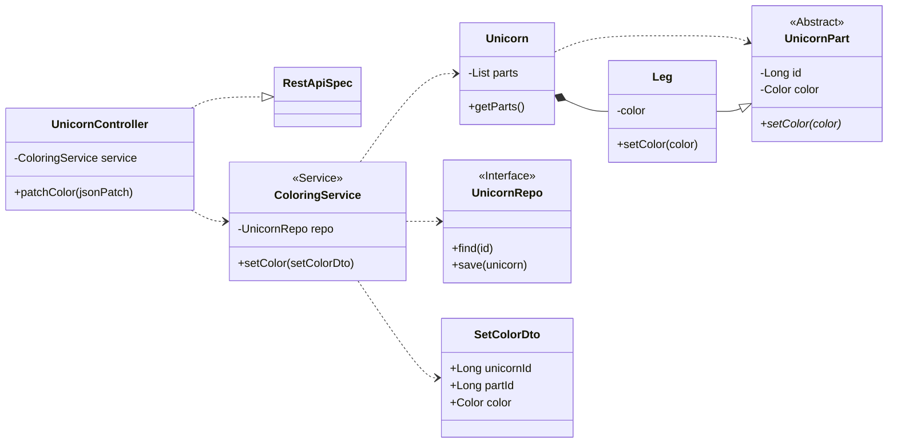
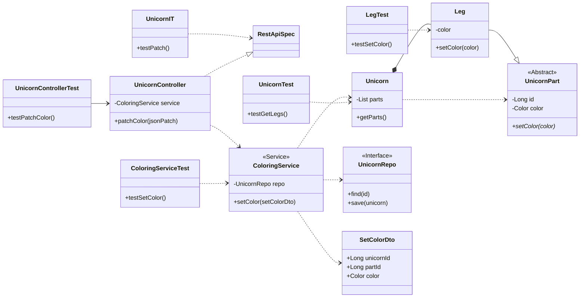
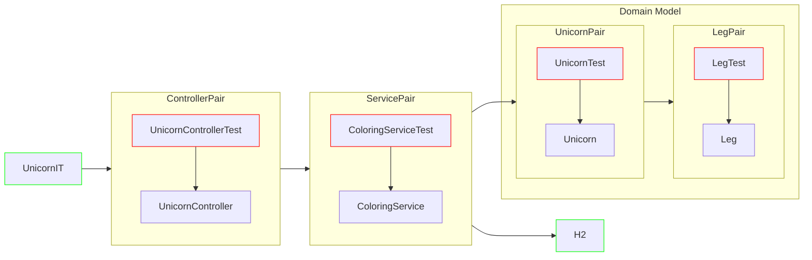
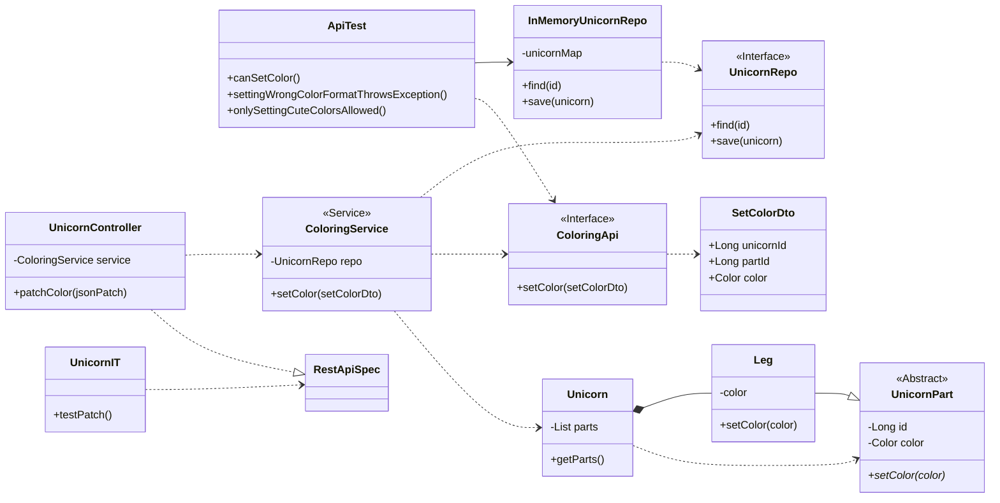
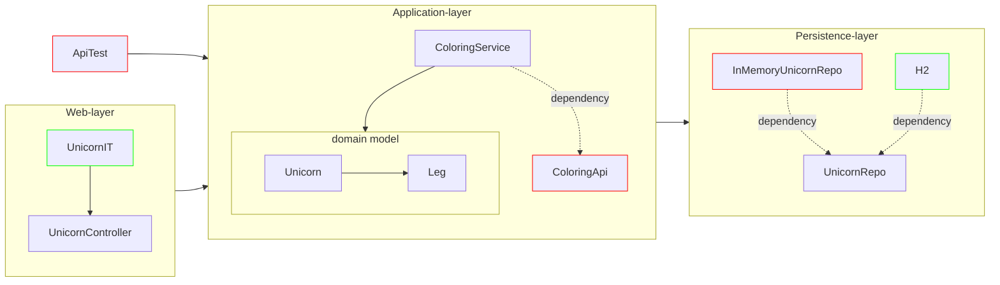

# Unicorn Backend Web Application

This repository contains the three-layer backend web application (unicorn-simple), refactored to hexagonal architecture.

For example requests to the Web API, see LegControllerRequestsSimple.postman_collection.json

## Sources

- Get Your Hands Dirty on Clean Architecture, Tom Hombergs
- https://docs.aws.amazon.com/prescriptive-guidance/latest/hexagonal-architectures/welcome.html (ook in PDF formaat)
- Migrating your Spring Boot application to Java Modules by Jaap Coomans – YouTube (presentatie @ Devoxx)
- https://cleancoders.com/library/all (Clean Code series videos door Robert C. Martin, aka Uncle Bob)
- Agile Software Development: Principles, Patterns and Practices, Robert C. Martin (aka Uncle Bob)
- The Java Module System, Nicolai Parlog
- https://github.com/TomCools/jpms-hexagonal-architecture (voorbeeld project door Tom Cools)

### Klasse diagram Unicorn app

### Klasse diagram test-per-klasse

### Flow-chart test-per-klasse

### Klasse diagram testen-via-api

### Flow-chart testen-via-api

